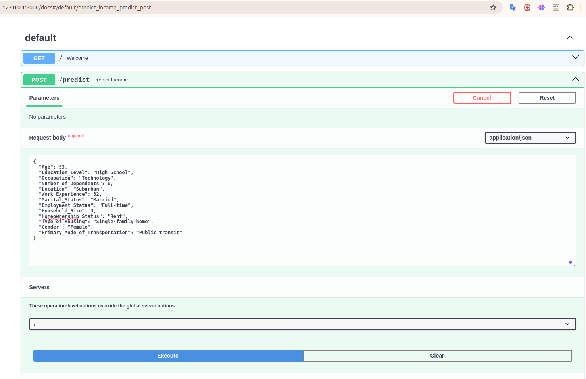
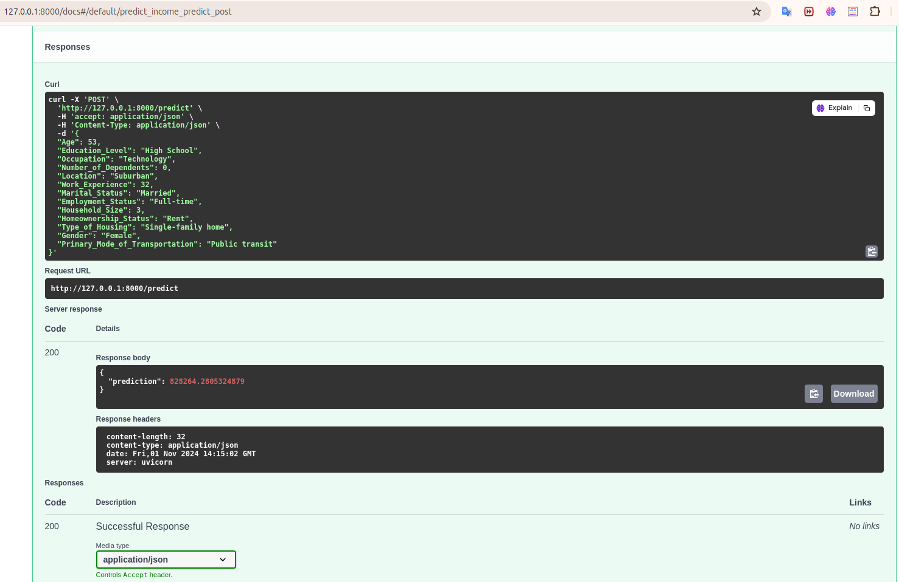

# Household-Income-API
Household Income get predict Income by using machine learning

## Docker
docker-hub https://hub.docker.com/repositories/walaa99
### build docker image
docker build -t walaa99/household-income:latest .
### run docker image
docker run -p 8000:8000 walaa99/household-income:latest
### push docker image
docker push walaa99/household-income:latest


## Requirements
python 3.10 or later

Enviroment
    
anaconda /visual studio code 

cd in path-folder

### Install 
```bash
$ pip install -r requirements.txt
```
```bash
$ uvicorn app:app --reload
```

## Deployment & use case

 ### 1- **API** 🤖




